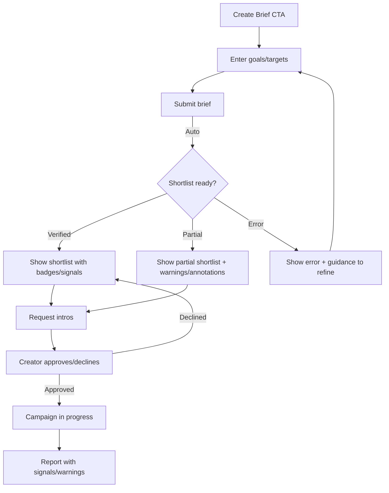
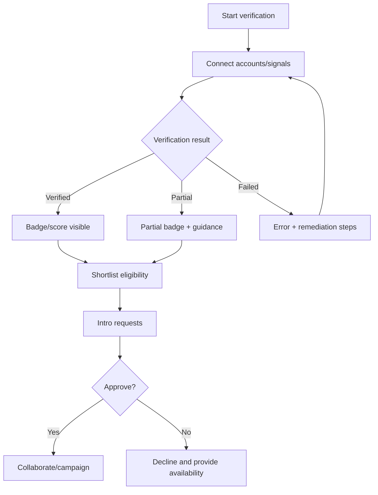
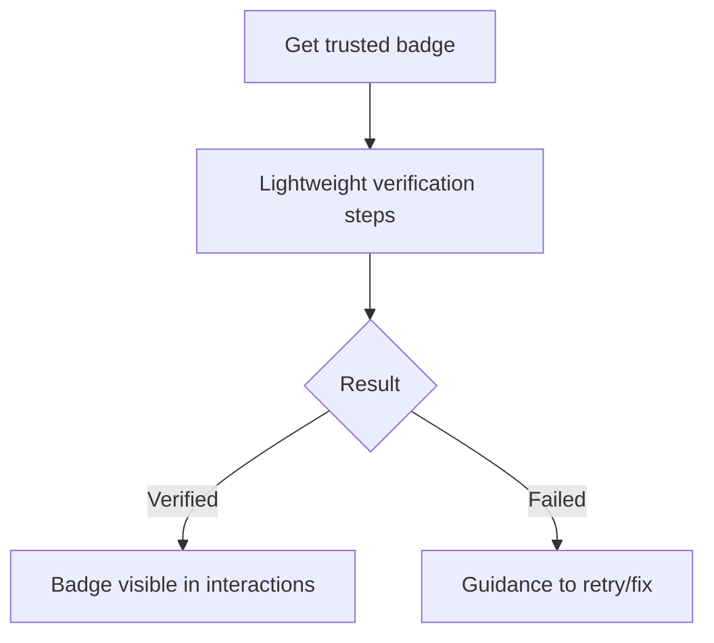
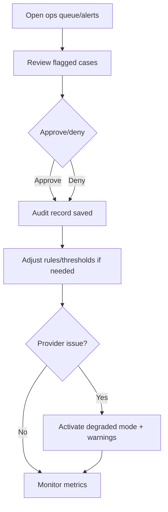

# UX Design Specification opencode

**Author:** Riddler
**Date:** 2025-12-03

---

<!-- UX design content will be appended sequentially through collaborative workflow steps -->

## Executive Summary

### Project Vision
A verification-first creator–brand–fan platform that proves audience authenticity, bakes in fraud/deepfake resistance, and gives brands transparent quality/reporting. Initial focus: micro/nano creators and LinkedIn/B2B segments, with diversification playbooks to reduce single-platform risk.

### Target Users
- Brand marketers needing credible, fraud-resistant creator matches and transparent reporting.
- Micro/nano and LinkedIn/B2B creators seeking trust signals and faster brand approvals.
- Fans who want lightweight verification for perks and to contribute trusted engagement.
- Ops/Admin ensuring verification quality, flags/overrides, and degraded-mode safety.

### Key Design Challenges
- Convey trust signals clearly (scores, flags, badges) without overwhelming users.
- Handle partial/failed states gracefully (partial shortlists, verification failures, degraded mode) while preserving confidence.
- Balance low-friction onboarding (creators/fans) with meaningful verification signals.

### Design Opportunities
- Trust UX as a differentiator: badges, transparent signals, annotated reports with warnings.
- Guided flows: brief intake to verified shortlist (with warnings) and intro approvals; recovery paths for verification.
- Diversification/risk cues in reports and shortlists to help brands avoid platform shocks.

## Core User Experience

### Defining Experience
- Core loop: brand posts brief → gets verified/partial shortlist with signals → requests/approves intros → runs campaign → views transparent report.
- Creator flow: one-session verification → authenticity score/badge → shortlist eligibility → approves intros → reports back.
- Fan flow: quick badge → trusted engagement counts → perks access.
- Ops/Admin: review flags/edge cases, adjust rules, manage degraded mode.

### Platform Strategy
- Primary: web app (desktop-first with responsive support); touch-friendly but optimized for mouse/keyboard productivity.
- No offline requirement; real-time-ish updates for shortlist/report readiness and alerts.
- Plug-in signal providers; degraded mode must show warnings and limit claims.

### Effortless Interactions
- Verification flows (creator/fan) feel lightweight, guided, and recoverable.
- Brief submission to shortlist retrieval is smooth, with clear status/warnings if partial.
- Trust UX always visible: badges, signals, warnings/annotations inline on profiles, shortlists, and reports.

### Critical Success Moments
- Creator sees authenticity badge/score that flips brand doubt.
- Brand receives a verified shortlist (or partial with warnings) within SLA and trusts the report signals.
- Fan earns badge in minutes and sees it reflected in interactions.
- Ops activates/reviews degraded mode without risking “unverified shown as verified.”

### Experience Principles
- Trust by default: signals and warnings are first-class, not buried.
- Graceful degradation: partial states and failures are explained, recoverable, and never misleading.
- Low-friction verification: minimal steps, clear guidance, fast completion.
- Transparency over mystery: brief → shortlist → intro → report steps are obvious, with status and auditability.

## Desired Emotional Response

### Primary Emotional Goals
- Confident and reassured that authenticity is proven (not guessed).
- In control and clear about status (verified, partial, degraded) with no surprises.
- Efficient and unblocked: “this just works and tells me what I need.”

### Emotional Journey Mapping
- First encounter: credibility and clarity (signals are obvious, not hype).
- Core flows (verification, shortlist, reports): confidence and calm; guided if partial/failed.
- After completion: relief + trust (“I can act on this”) and readiness to repeat.
- When things go wrong: safe, informed, recoverable—never panic or doubt the data.
- Return visits: dependable, transparent, quick to value.

### Micro-Emotions
- Confidence over confusion; trust over skepticism.
- Calm over anxiety when signals are partial/flagged.
- Clarity over ambiguity about status, warnings, and next steps.

### Design Implications
- Trust UX first-class: badges, signals, warnings/annotations always visible and legible.
- Guided recovery for partial/failed states; friendly copy that protects user confidence.
- Clear status and next-step cues in briefs → shortlist → intro → report flows; auditability visible.
- Progressive disclosure to avoid overwhelm; consistent iconography/color for trust cues.

### Emotional Design Principles
- Transparency beats mystery: show signals, reasons, and provenance.
- Graceful degradation: partial states are honest, annotated, and recoverable.
- Low cognitive load: keep verification and shortlist/report review simple and guided.
- Protective by default: never mislead; status and warnings are unmissable yet calm.

## UX Pattern Analysis & Inspiration

### Inspiring Products Analysis
- LinkedIn (creator/brand trust): Clear identity signals, profile credibility, lightweight messaging for intros; transparent “who viewed/engaged” cues build trust.
- Notion (clarity and progressive disclosure): Clean hierarchy, inline badges/annotations without clutter; lets users expand for detail only when needed.
- Stripe Dashboard (status and auditability): Clear states (succeeded/pending/failed), timelines/audit trails, and actionable alerts; errors are explained and recoverable.

### Transferable UX Patterns
- Status clarity: Badge + inline signals + tooltips (LinkedIn/Stripe) to convey trust state without clutter.
- Progressive disclosure: High-level cards with expandable details (Notion) for reports and signals.
- Guided actions: Timeline/checklist for brief → shortlist → intro → campaign/report (Stripe-style flows).
- Inline annotations: Warnings/partial states placed next to affected items (e.g., shortlist entries, signal gaps).

### Anti-Patterns to Avoid
- Hidden trust cues (burying signals in secondary screens).
- Vague errors or silent failures; unannotated partial shortlists.
- Overloaded dashboards that mix status, alerts, and actions without hierarchy.

### Design Inspiration Strategy
- Adopt: Clear state chips/badges + inline annotations for signals/warnings; timeline-style flow for briefs/intros/campaigns.
- Adapt: Progressive disclosure for reports/shortlists—surface highlights, expand for detailed signals.
- Avoid: Ambiguous states and buried trust cues; unstructured error messaging.

## User Journey Flows

### Brand: Brief → Shortlist → Intro → Report
Entry: Brand clicks “Create brief.” Flow: define goals/targets → submit → system generates verified or partial shortlist with badges/annotations → brand requests/approves intros → runs campaign → views report with signals and warnings. Success: actionable shortlist fast; trust in signals; clear approvals and annotated report. Failure/recovery: partial shortlist with warnings; ability to refine brief; errors surfaced inline with guidance.

### Creator: Verification → Shortlist Eligibility → Intros
Entry: Creator starts verification from profile. Flow: connect accounts → verification signals → badge/score → eligible for shortlists → receive intro requests → accept/decline → collaborate → reflected in report. Success: one-session verification; badge visible; clear intros and statuses. Failure/recovery: failed/partial verification shows reasons and next steps; can retry.

### Fan: Quick Badge
Entry: Fan taps “Get trusted badge.” Flow: lightweight verification → badge on interactions → perks access. Success: badge in minutes; visible in interactions. Failure/recovery: failed verification shows friendly guidance; retry available.

### Ops/Admin: Flags, Overrides, Degraded Mode
Entry: Ops opens alerts/queue. Flow: review flagged cases → approve/deny with audit trail → adjust rules/thresholds → manage degraded mode (activate/communicate warnings) → monitor metrics. Success: edge cases resolved safely; no unverified shown as verified; degraded mode explicit. Failure/recovery: if provider outage, degraded mode on; if rule change backfires, revert via audit log.

### Journey Patterns
- Status clarity: chips/badges + tooltips; partial/failed states annotated at point of decision.
- Guided flows with progressive disclosure: summary first, expand for detail (signals/reports).
- Recovery built-in: partial/failed flows loop back with guidance; degraded mode explicit.

### Flow Optimization Principles
- Minimize steps to value: keep verification and shortlist retrieval tight; show status early.
- Keep trust cues proximate: badges/annotations inline where decisions happen.
- Handle edge cases calmly: warnings + next steps; never mislabel unverified as verified.

## UX Consistency Patterns

### Button Hierarchy
- Primary for the main forward action on a view (e.g., submit brief, request intros); Secondary for supportive actions (edit, refine); Tertiary/text for light options (learn more, view details). Place only one Primary per context.
- States: default, hover, focus-visible, active, disabled, loading. Always include focus styles.
- Icons: only when they add clarity (e.g., download, external link, warning).

### Feedback Patterns
- Success: inline or toast with clear next step; semantic success token.
- Warning/partial: inline near the affected item; chip + tooltip; avoid toasts for structural warnings.
- Error: inline at field + summary if form-level; explain cause and remediation; keep errors persistent until resolved.
- Info: subtle, paired with icon; avoid overuse.

### Form Patterns
- Labels always visible; helper text for context; inline validation on blur/submit; error text adjacent to the field.
- Required fields marked with text/icon; avoid asterisk-only.
- Group related fields; use progressive disclosure for advanced options.
- Keyboard support: tab order logical; Enter submits when appropriate; Esc closes modals.

### Navigation Patterns
- Global top/left nav for main areas: Briefs, Shortlists, Intros, Campaigns/Reports, Signals/Ops.
- Within flows, use timeline/steps for progress; breadcrumbs optional for deep ops/admin paths.
- Keep trust cues visible in list/detail views (chips/badges in cards/rows).

### Additional Patterns
- Modals/Drawers: use for focused tasks; must have close controls, escape, and focus trap.
- Empty States: explain value, provide primary action; avoid dead ends.
- Loading: skeletons for lists/reports; spinners for short waits; keep context visible when possible.
- Search/Filters: inline filters with chips; show active filters and quick clear.
- Alerts/Annotations: place warnings at the point of relevance (shortlist entries, signals); pair icon + text; keep concise.

## Responsive Design & Accessibility

### Responsive Strategy
- Desktop-first responsive with usable tablet and mobile adaptations. Desktop: 12-col layouts with side panels and card + timeline flows; keep trust cues inline. Tablet: reduce columns, keep timelines/cards readable; touch targets sized. Mobile: prioritize shortlist/report summaries, status chips, and actions; bottom or simple top nav; collapse filters into sheets/drawers.

### Breakpoint Strategy
- Standard breakpoints: mobile <768px, tablet 768–1023px, desktop 1024px+. Mobile-first media queries; adjust density and layout components (cards stack, tables become cards).

### Accessibility Strategy
- Target WCAG 2.1 AA. Contrast for text/icons; color + icon/label for states; focus visible everywhere; semantic landmarks. Touch targets ≥44px; keyboard nav and screen reader support for timelines/steps, tables, modals; announce status changes and errors.

### Testing Strategy
- Responsive: test on Chrome/Firefox/Safari/Edge, actual devices for mobile/tablet; check performance on slower networks. Accessibility: automated checks + keyboard-only + screen reader (VoiceOver/NVDA) passes; color-blindness simulation; focus order validation.

### Implementation Guidelines
- Use rem/% for sizing; mobile-first media queries. Semantic HTML, aria-labels/roles for custom components, focus management for modals/drawers, skip links. Ensure state chips/badges are icon+text; skeletons over spinners for data loads where possible.

## Component Strategy

### Design System Components
- Foundation (from themeable system): buttons, inputs, selects, text areas, modals/drawers, tabs, accordions, tables, lists, badges/chips, alerts/toasts, cards, timelines/steps, tooltips, progress/spinners.
- Layout: grid/stack primitives; responsive utilities.
- Form helpers: form fields with validation states.

### Custom Components
- Trust Signal Badge/Card: summarizes authenticity score, key signals, and flags; supports tooltip/expand.
- Shortlist Card with Annotations: creator summary with badges, fit notes, and warnings for partial/degraded states.
- Report Signal Section: expandable signals with status chips, provenance notes, and warnings.
- Ops Flag Queue Item: flag reason, signal snapshot, actions (approve/deny), and audit trail link.
- Degraded Mode Banner/Inline Notice: communicates partial signals and limitations; scoped to affected areas.

### Component Implementation Strategy
- Build custom components on design-system primitives; wire semantic tokens for trust states (verified/success, warning/partial, error).
- Keep icon + label for all stateful elements; tooltips for explanations; aria-labels and focus states consistent.
- Reuse patterns: card + inline chips for lists, timeline/steps for flows, annotations for partial/degraded states.

### Implementation Roadmap
- Phase 1 (MVP): Trust Signal Badge/Card; Shortlist Card with Annotations; Report Signal Section; Degraded Mode Notice; core forms/buttons/alerts.
- Phase 2 (Growth): Ops Flag Queue Item; richer tables for reports/ops; advanced filters for briefs/shortlists.
- Phase 3 (Expansion): Multi-tenant admin consoles with audit explorers; configurable signal views; saved report layouts.
## Design System Foundation

### 1.1 Design System Choice
- Themeable system with strong foundations (e.g., Chakra/MUI/Tailwind UI with custom tokens), web-first.

### Rationale for Selection
- Need speed + trust clarity; foundation components speed delivery while allowing clear trust cues (badges, chips, inline annotations).
- Brand differentiation needed for trust UX; themeable tokens enable unique signals without building from scratch.
- Team is lean; leveraging mature components reduces risk and supports accessibility out of the box.

### Implementation Approach
- Web app, desktop-first responsive; component library with badge/chip, cards, timeline/steps, tables, modals, toast/inline alerts.
- Establish design tokens (colors, typography, spacing, radius, shadows) aligned to trust cues and accessibility (WCAG AA).
- Use timeline/checklist patterns for brief → shortlist → intro → campaign/report; inline annotations for partial/degraded states.

### Customization Strategy
- Tokens for trust states: verified, partial, warning/degraded, error; high-contrast-safe palettes.
- Custom trust components: signal badges, annotated shortlists/reports, status chips with tooltips.
- Progressive disclosure defaults: summary cards with expandable detail for signals/reports; consistent iconography for trust states.

## Visual Design Foundation

### Color System
- Trust-forward palette using themeable tokens: `primary` (deep blue/ink) for credibility, `accent` (teal) for actions/links, `success` (green) for verified, `warning` (amber) for partial/degraded, `error` (red) for failures, `info` (blue) for neutral signals.
- Background/Surface: light mode with soft gray surfaces; dark neutrals reserved for overlays/modals.
- Semantic mapping: badges/chips use semantic tokens; warnings/partials always paired with icon + text.
- Accessibility: target AA contrast for text/icons; avoid color-only state—pair with icon/label.

### Typography System
- Tone: professional, clear, calm.
- Primary type: humanist sans (e.g., Inter/IBM Plex Sans family); fallback: system sans.
- Scale: base 16px; H1 28–32, H2 24, H3 20, body 16, caption 13–14; line-height 1.4–1.6 for body.
- Usage: headings for hierarchy; body for descriptions and inline signals; optional monospace for IDs/logs in admin views.

### Spacing & Layout Foundation
- Spacing unit: 8px base (4px for tight inline elements).
- Layout: desktop-first responsive; 12-column grid with generous gutters; cards for shortlists/reports; side panels for details.
- Density: moderate—breathing room around trust cues so badges/annotations stay legible.
- Component spacing: 12–16px padding in cards; 8px between controls; 16–24px between sections.

### Accessibility Considerations
- WCAG 2.1 AA: color contrast and focus states on all interactive elements.
- State communication: icon + label for verified/partial/warning/error; tooltips for explanations.
- Keyboard and screen reader support for timelines/steps, tables, modals; announce status changes.

## Design Direction Decision

### Design Directions Explored
- Direction A: Clarity/Trust First — light surfaces, neutral base, teal accent for actions, badges/chips + inline annotations, card + timeline layout.
- Direction B: Ops-Dense — tighter spacing, side-by-side tables + panels for power users, elevated alerts; risk of visual overload for general users.
- Direction C: Bold Accent Minimal — high-contrast accent blocks, minimal text; fast scannability but weaker trust nuance.

### Chosen Direction
- Direction A: Clarity/Trust First.

### Design Rationale
- Puts trust cues (badges, warnings, annotations) front-and-center without clutter.
- Supports progressive disclosure (cards with expandable details) and timeline/checklist flow for brief → shortlist → intro → report.
- Balances clarity and accessibility (neutral base, high-contrast semantic states, ample spacing) for both marketers and ops.

### Implementation Approach
- Use card + timeline/steps as primary scaffolding; inline chips/badges for trust states; annotations for partial/degraded.
- Apply semantic tokens (verified/success, warning/partial, error) with icon + label; keep accent usage focused on key actions.
- Maintain moderate spacing and clear hierarchy; keep alerts/annotations proximate to affected items; ensure responsive behavior for desktop-first layouts.

## 2. Core User Experience

### 2.1 Defining Experience
- Defining loop: brand posts a brief → receives a verified (or partial-with-warnings) shortlist with trust signals → requests/approves intros → runs campaign → reviews transparent report. This trust-first matching/reporting loop is the signature experience.
- Creator defining flow: one-session verification to earn authenticity score/badge → shortlist eligibility → approve intros → deliver and reflect in report signals.
- Ops/Admin defining flow: review/override flags, manage degraded mode, and ensure “never show unverified as verified.”

### 2.2 User Mental Model
- Brands expect a marketplace-like flow (brief → shortlist → intros → campaign → report) with clear fit filters and credible signals; they’re used to dashboards with status chips, timelines, and audit trails (Stripe-like clarity).
- Creators expect lightweight onboarding (LinkedIn/creator-tool mental model), with profile signals they can trust and share; they expect quick approvals and messaging.
- Fans expect a quick badge (social app mental model) and visible recognition in interactions.
- Ops expect queues, alerts, overrides, and auditable changes (ops console mental model).

### 2.3 Success Criteria
- Brands: See a trustworthy shortlist (or partial with explicit warnings) fast; understand why each match is credible; act with confidence from reports.
- Creators: Verify in one sitting; see badge/score that flips brand doubt; manage intros without confusion.
- Fans: Earn badge in minutes; see it reflected immediately; no embarrassment on failure—guided recovery.
- Ops: Handle edge cases without risking false verification; degraded mode is explicit and guarded.

### 2.4 Novel UX Patterns
- Mostly established patterns (cards, chips/badges, timelines, inline annotations). Novel twist: transparency of trust signals + partial-list warnings as first-class UI, and annotated degraded mode. Education via inline tooltips and consistent iconography.

### 2.5 Experience Mechanics
- Initiation: Brand starts a brief from a clear CTA; Creator/Fan starts verification from profile entry points; Ops opens flagged queue/alerts.
- Interaction: Forms with guided steps; shortlist view with badges/warnings; intro approvals; report with expandable signals; ops overrides with reasons.
- Feedback: Inline badges/chips, tooltips, progress states; warnings on partial/degraded; confirmations on approvals and completions.
- Completion: Brand sees report and understands next steps; Creator sees collab status and payout/report linkage; Fan sees badge live; Ops sees queue cleared and audit logged.
