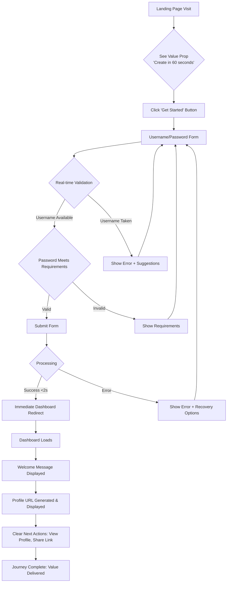
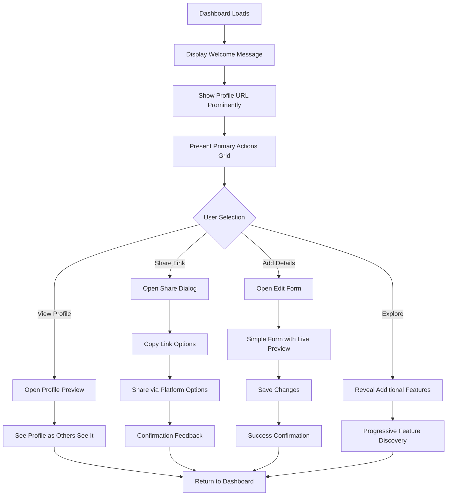
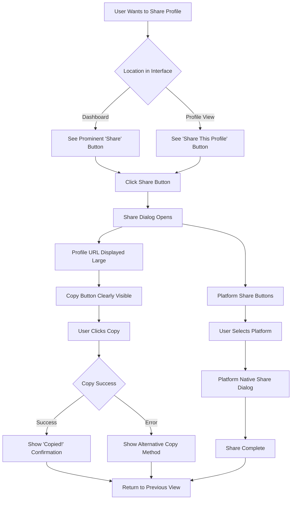
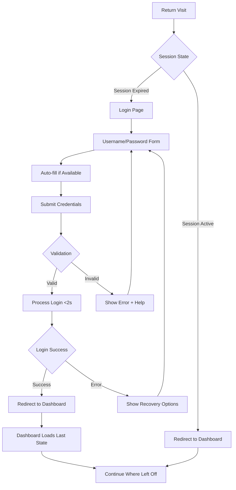

# UX Design Specification profile

**Author:** Riddler
**Date:** 2025-12-12 (updated with Profile URL Display Component text wrapping fix)

---

<!-- UX design content will be appended sequentially through collaborative workflow steps -->

## Executive Summary

### Project Vision

Profile is a web application that provides ultra-simple, frictionless onboarding for users to establish a basic online presence. The vision is to create a platform where anyone can have a clean, minimal digital profile in under 60 seconds, without the complexity and feature overload of traditional platforms. It's designed as a foundational starting point that users can grow with over time.

### Target Users

Primary users are individuals seeking to establish a simple online presence quickly, such as creatives (photographers, artists), professionals wanting a clean digital business card, or anyone frustrated by complex signup processes. They value simplicity, speed, and minimal friction over extensive feature sets. Tech savviness ranges from non-technical users who want something "just works" to more technical users appreciating the clean architecture.

### Key Design Challenges

1. **Friction vs. Security Balance**: Creating an authentication experience that feels "ultra-simple" while maintaining user trust and perceived security without email verification.
2. **Empty State to Value**: Guiding users from a brand new, empty profile to feeling they've established meaningful online presence immediately.
3. **Simplicity Without Sparseness**: Designing interfaces that feel clean and minimal without appearing unfinished or lacking functionality.
4. **Cross-Platform Consistency**: Maintaining the same "simple" emotional tone and usability across mobile, tablet, and desktop devices.

### Design Opportunities

1. **Delight Through Speed**: Celebrating the 60-second promise with micro-interactions that make speed feel rewarding.
2. **Progressive Revelation**: Starting simple but intelligently revealing more capabilities as users grow comfortable.
3. **Visual Storytelling**: Using clean visual hierarchy to make minimal content feel intentional and curated.
4. **Shareability as Core Feature**: Designing profile URLs and sharing as integrated, rewarding parts of the experience.

## Core User Experience

### Defining Experience

The core user experience revolves around ultra-simple authentication leading to immediate profile establishment and effortless sharing. The primary user loop is: **Signup (60 seconds) → Dashboard (immediate access) → Profile (clean display) → Share (easy distribution)**. Every aspect of the experience prioritizes speed, simplicity, and immediate value creation over feature density.

### Platform Strategy

Profile is a responsive Single Page Application (SPA) built with a mobile-first approach but designed to work seamlessly across desktop, tablet, and mobile devices. The platform leverages modern web capabilities while maintaining compatibility with target browsers (latest Chrome, Firefox, Safari, Edge). No native mobile apps or offline functionality required for MVP; the focus is on delivering a polished, performant web experience.

### Effortless Interactions

1. **60-Second Signup**: Account creation with only username and password should feel instant and require zero decision-making.
2. **Immediate Dashboard Access**: No waiting, verification delays, or setup wizards - users land in their dashboard immediately.
3. **Intuitive Profile Sharing**: Profile URLs should be obvious to find, copy, and share with minimal effort.
4. **Seamless Authentication**: Login/logout should work without friction or confusion, maintaining session state appropriately.
5. **Clear Value Progression**: Users should understand what to do next without guidance or tutorials.

### Critical Success Moments

1. **Account Creation Success**: The moment users complete signup and immediately see their dashboard - proving the "60-second promise" is real.
2. **First Profile View**: When users see their profile as others will see it, confirming they've established an online presence.
3. **First Successful Share**: When users successfully share their profile link and receive positive feedback about its simplicity.
4. **Dashboard Clarity**: The moment users understand their dashboard's purpose and available actions without explanation.
5. **Return Visit Ease**: When returning users can immediately continue where they left off without re-learning the interface.

### Experience Principles

1. **Speed as a Feature**: Every interaction should feel fast and efficient, celebrating the 60-second signup promise as a core value, not just a metric.
2. **Simplicity Above All**: Interface and interactions should be minimal and intuitive, removing all unnecessary complexity and prioritizing clarity over features.
3. **Immediate Value Creation**: Users should feel they've established something meaningful from the moment they create an account, with no empty "getting started" phase.
4. **Shareability Built-In**: Profile URLs and sharing mechanics should feel like natural extensions of the experience, not secondary features.
5. **Frictionless Transitions**: Moving between authentication, dashboard, and profile viewing should feel seamless and natural, with no jarring context switches.

## Desired Emotional Response

### Primary Emotional Goals

Users should feel **empowered and efficient** - like they've taken control of their online presence without the usual hassle, and accomplished something meaningful in minimal time. The emotional experience should reinforce the core value proposition: simplicity, speed, and immediate value creation.

### Emotional Journey Mapping

1. **Discovery Phase**: Curiosity mixed with skepticism (hoping this truly is simpler than alternatives)
2. **Signup Experience**: Surprise at the simplicity, followed by growing confidence as the process progresses
3. **Dashboard First View**: Accomplishment and clarity (seeing their profile immediately, understanding what's possible)
4. **Profile Customization**: Creative control and personalization (feeling ownership over their digital space)
5. **Sharing Moment**: Pride and satisfaction (successfully establishing and sharing their online presence)
6. **Return Visits**: Familiarity and efficiency (comfortable navigation, no re-learning required)

### Micro-Emotions

**Critical Positive Micro-Emotions:**
- **Confidence**: Users feel sure they're making the right choices
- **Trust**: Belief in the platform's security and reliability despite minimal verification
- **Accomplishment**: Feeling of achievement after establishing their profile
- **Delight**: Pleasant surprise at simplicity and speed

**Critical Negative Micro-Emotions to Avoid:**
- **Anxiety**: Worry about security or making mistakes
- **Confusion**: Uncertainty about what to do next
- **Frustration**: Impatience with process or interface
- **Skepticism**: Doubt about platform legitimacy or value

### Design Implications

1. **Empowerment Design**: Clear control points, obvious action buttons, immediate visual feedback for user actions
2. **Efficiency Design**: Minimized steps in all flows, smart defaults, progressive disclosure of complexity
3. **Trust Design**: Professional aesthetic, clear security indicators, transparent data handling explanations
4. **Delight Design**: Micro-interactions celebrating speed, clever copy acknowledging simplicity, smooth transitions
5. **Confidence Design**: Clear success states, error recovery that feels helpful, consistent interface patterns

### Emotional Design Principles

1. **Clarity Over Mystery**: Every interface element should have obvious purpose and function
2. **Speed as Emotional Benefit**: Fast interactions should feel rewarding, not just functional
3. **Progressive Trust Building**: Design should build trust through consistency and transparency
4. **Celebrate Small Wins**: Acknowledge user accomplishments through design feedback
5. **Maintain Calm Authority**: Interface should feel confident and reliable, not anxious or uncertain
6. **Minimize Cognitive Load**: Reduce decisions required, making the experience feel effortless

## UX Pattern Analysis & Inspiration

### Inspiring Products Analysis

**Carrd (One-Page Website Builder):**
- Solves personal website creation with dead-simple approach
- Effective onboarding: minimal signup, immediate template selection, live previews
- Navigation: single-page focus, clear section editing, no complex menus
- Delightful interactions: live preview updates, simple drag-and-drop
- Visual design: clean whitespace, focused content areas, minimal chrome
- Error handling: simple validation, clear messages, easy recovery

**Linear (Project Management):**
- Makes complex project tracking feel simple and fast
- Effective onboarding: keyboard-first approach taught gradually
- Navigation: command palette for everything, clear issue states
- Delightful interactions: powerful keyboard shortcuts, smooth animations
- Visual design: spartan aesthetic, functional beauty, no unnecessary elements
- Error handling: helpful suggestions, autocomplete, forgiving input

**Notion (All-in-One Workspace):**
- Makes powerful tools accessible through simple building blocks
- Effective onboarding: template gallery, gradual feature discovery
- Navigation: clean sidebar, breadcrumb navigation, consistent structure
- Delightful interactions: slash commands, drag-to-create, live collaboration
- Visual design: neutral color palette, clean typography, generous spacing
- Error handling: auto-save, version history, clear sync status

### Transferable UX Patterns

**Navigation Patterns:**
1. **One-Page Focus** (from Carrd) - Keep dashboard simple and accessible without complex navigation
2. **Command Palette/Quick Actions** (from Linear) - Efficient navigation between authentication, dashboard, and profile views
3. **Clean Sidebar + Breadcrumb** (from Notion) - Clear hierarchy for profile management

**Interaction Patterns:**
1. **Immediate Template Selection** (from Carrd) - Quick profile setup with basic layout options
2. **Keyboard-First Efficiency** (from Linear) - Power user support while remaining simple for beginners
3. **Gradual Feature Discovery** (from Notion) - Progressive revelation of advanced features
4. **Live Preview Updates** (from Carrd) - Instant visual feedback during profile customization

**Visual Patterns:**
1. **Clean Whitespace & Minimal Chrome** (from Carrd) - Supports simplicity and makes content the hero
2. **Functional Beauty** (from Linear) - Aligns with efficiency-focused requirements
3. **Neutral Color Palette** (from Notion) - Allows user content and customization to be the focus
4. **Consistent Typography Scale** - Creates professional appearance with minimal effort

### Anti-Patterns to Avoid

1. **Complex Multi-Step Wizards** - Creates friction and undermines 60-second simplicity
2. **Overwhelming Dashboard** - Too many options or "getting started" prompts
3. **Hidden Sharing Features** - Profile URLs or share buttons buried in settings
4. **Slow Loading** - Undermines speed promise and emotional benefit
5. **Empty State Anxiety** - Blank dashboards that make users feel lost
6. **Feature Overload** - Showing all capabilities at once instead of progressive disclosure

### Design Inspiration Strategy

**What to Adopt:**
- **One-Page Dashboard Approach** - Supports core experience of immediate value and simplicity
- **Live Preview Updates** - Aligns with user needs for instant feedback during customization
- **Clean Whitespace & Minimal Chrome** - Supports "simple" emotional goal and makes user content the hero
- **Gradual Feature Discovery** - Allows starting simple while supporting future growth

**What to Adapt:**
- **Command Palette** - Modify for profile-specific quick actions (signup, login, profile view, share)
- **Template Selection** - Simplify for basic profile layouts rather than full website templates
- **Keyboard-First Efficiency** - Simplify for core actions while maintaining mouse/touch accessibility
- **Neutral Color Palette** - Adapt to include subtle brand personality while keeping user content as focus

**What to Avoid:**
- **Complex Multi-Step Wizards** - Conflicts with 60-second simplicity goal
- **Overwhelming Dashboard** - Doesn't fit minimal, focused platform approach
- **Hidden Sharing Features** - Conflicts with shareability as core feature principle
- **Empty State Anxiety** - Undermines immediate value creation emotional goal

## Design System Foundation

### 1.1 Design System Choice

**MUI (Material-UI)** - Material Design-based component library for React, chosen for its production-ready components, strong theming system, and excellent accessibility defaults.

### Rationale for Selection

1. **Speed to MVP**: Production-ready components accelerate development of authentication flows, dashboards, and profile interfaces
2. **Accessibility Built-in**: Strong accessibility defaults align with profile's WCAG compliance requirements
3. **Theming Flexibility**: Material Design theming system allows customization to achieve clean, minimalist aesthetic
4. **Community & Documentation**: Extensive resources and examples help small teams move quickly
5. **SPA Compatibility**: Excellent React integration fits profile's Single Page Application architecture
6. **Balance of Speed & Uniqueness**: Customizable enough to create distinctive interface while maintaining development velocity

### Implementation Approach

- Leverage MUI's comprehensive component library for authentication forms, navigation, and layout
- Implement custom theme with design tokens overriding Material Design defaults
- Use React integration for SPA architecture with client-side routing
- Build custom components only where MUI's offerings don't meet profile's unique needs
- Maintain accessibility compliance through MUI's built-in accessibility features

### Customization Strategy

1. **Theme Customization**: Create custom theme with reduced visual complexity, clean typography, and generous spacing
2. **Design Tokens**: Establish profile-specific color palette, typography scale, and spacing system
3. **Component Adaptation**: Simplify MUI components to align with "ultra-simple" aesthetic (reduced borders, shadows, decoration)
4. **Progressive Enhancement**: Start with MUI defaults, then systematically customize to achieve distinctive brand identity
5. **Accessibility Maintenance**: Preserve MUI's accessibility foundations while customizing visual appearance

## 2. Core User Experience

### 2.1 Defining Experience

**60-second signup → immediate dashboard → profile sharing** - The core interaction that defines profile's value proposition. Users create a functional online presence in under a minute, with no email verification or complex setup, and immediately have a clean, shareable profile URL.

### 2.2 User Mental Model

Users expect profile creation to be complex (email verification, multi-step setup, feature overload) based on experiences with platforms like LinkedIn, social media, and personal website builders. They bring skepticism about "simple" claims but desire genuine simplicity. Key mental shifts required:
- Trusting platform security without email verification
- Accepting minimal interface as feature, not lack
- Understanding immediate value from empty starting state

### 2.3 Success Criteria

1. **Speed Perception**: Signup feels faster than promised (under 60 seconds)
2. **Immediate Value**: Dashboard feels useful and complete immediately after signup
3. **Obvious Sharing**: Profile URL is prominently displayed and easy to copy/share
4. **Zero Confusion**: Users understand what to do next without guidance
5. **Trust Established**: Platform feels secure and professional despite minimal verification

### 2.4 Novel UX Patterns

**Established Patterns with Innovative Simplification:**
- **Authentication**: Username/password-only (no email) - familiar pattern minus friction point
- **Dashboard**: One-page focus with clear actions - established layout with minimal complexity
- **Profile Management**: Simple form editing - familiar interaction with reduced fields
- **Sharing**: Prominent URL display - established pattern with priority placement

**Novel Combination**: Ultra-simple authentication + immediate value creation + shareability as core feature

### 2.5 Experience Mechanics

**1. Initiation:**
- Landing page: Clear value prop "Create your online profile in 60 seconds"
- Trigger: Prominent "Get Started" button revealing minimal signup form

**2. Interaction:**
- User action: Enters username and password, clicks "Create Profile"
- System response: Immediate processing (<2s), subtle loading indicator, instant dashboard redirect

**3. Feedback:**
- Success: Clear "Profile created!" message, immediate dashboard access, visible profile URL
- Error: Inline validation, helpful messages, easy correction without losing progress

**4. Completion:**
- Outcome: Live profile at clean URL (profile.site/username), shareable link available
- Next steps: Obvious actions - "View Profile," "Share Link," "Add Details" - with clear visual hierarchy

## Visual Design Foundation

### Color System

**Recommended Theme: Clean Professional**
- **Primary:** #2c5282 (Trustworthy blue)
- **Secondary:** #4a5568 (Slate gray)
- **Accent:** #38b2ac (Teal for highlights)
- **Background:** #f7fafc (Light gray)
- **Text:** #1a202c (Dark charcoal)

**Color Strategy:**
- **Trust & Professionalism:** Blue-based palette establishes credibility
- **Simplicity:** Limited color palette (5 primary colors) reduces visual complexity
- **Accessibility:** All colors meet WCAG 2.1 Level A contrast requirements
- **Semantic Meaning:** Consistent color usage across interface states
- **Emotional Alignment:** Cool, professional tones support efficiency and trust goals

*Alternative themes available in `ux-color-themes.html` visualizer: Minimalist Modern, Warm Approachable, Cool Efficient*

### Typography System

**Primary Typeface:** Inter (with system font stack fallback)
- `-apple-system, BlinkMacSystemFont, 'Segoe UI', Roboto, Oxygen, Ubuntu, sans-serif`

**Type Scale (16px base):**
- **H1:** 2.5rem (40px) - Page headlines, major CTAs
- **H2:** 2rem (32px) - Section headers
- **H3:** 1.5rem (24px) - Subsection headers
- **H4:** 1.25rem (20px) - Card titles, important labels
- **Body:** 1rem (16px) - Main content, form input text
- **Small:** 0.875rem (14px) - Form labels, helper text, metadata
- **Micro:** 0.75rem (12px) - Captions, legal text, timestamps

**Font Weights:**
- **Regular (400):** Body text, standard interface elements
- **Medium (500):** Emphasis, secondary buttons
- **Semibold (600):** Headings, primary labels, important text
- **Bold (700):** Primary CTAs, key highlights, critical information

**Line Heights:**
- **Headings:** 1.2 (tight for visual hierarchy)
- **Body:** 1.5 (comfortable reading)
- **Small text:** 1.4 (balanced readability)

### Spacing & Layout Foundation

**Base Spacing Unit:** 8px (0.5rem)
- Provides granular control while maintaining consistency
- Multiples: 4px, 8px, 16px, 24px, 32px, 48px, 64px

**Spacing Guidelines:**
- **Between form fields:** 24px (1.5rem)
- **Between sections:** 48px (3rem)
- **Component padding:** 16px (1rem) minimum
- **Card spacing:** 24px (1.5rem) between cards
- **Line spacing:** 24px (1.5rem) between paragraphs

**Grid System:**
- **Desktop:** 12-column flexible grid, 24px gutters, max width 1200px
- **Tablet:** 8-column grid
- **Mobile:** 4-column grid, fluid layout
- **Breakpoints:** Mobile (<768px), Tablet (768px-1024px), Desktop (>1024px)

**Layout Principles:**
1. **Mobile-First Progressive Enhancement:** Design for smallest screens first
2. **Consistent Vertical Rhythm:** Maintain predictable spacing between elements
3. **Content-First Hierarchy:** Visual flow guides users to primary actions
4. **Flexible Containers:** Components adapt to content, not fixed widths
5. **Generous Whitespace:** Airy spacing supports "simple" emotional goal

### Accessibility Considerations

**Color Accessibility:**
- Minimum 4.5:1 contrast ratio for normal text
- Minimum 3:1 contrast ratio for large text
- Color not used as sole indicator of meaning
- Sufficient contrast for interactive states (hover, focus, active)

**Typography Accessibility:**
- Scalable text (no fixed pixel sizes in production)
- Clear visual hierarchy for screen readers
- Sufficient line spacing for readability
- Responsive type scaling for different viewports

**Interactive Element Accessibility:**
- Minimum 44px touch targets for mobile
- Clear focus indicators for keyboard navigation
- Descriptive labels for form elements
- Error messages associated with form fields

**Layout Accessibility:**
- Logical tab order following visual flow
- Responsive design for different abilities and devices
- Sufficient spacing for users with motor control challenges
- Clear visual separation of distinct content areas

## Design Direction Decision

### Design Directions Explored

Six distinct design directions were explored through interactive HTML mockups:

1. **Minimalist Dashboard** - Extreme simplicity with maximum whitespace, focused on one primary action at a time
2. **Card-Based Layout** - Modular organization with clear visual separation in distinct cards
3. **Command-Center Approach** - Keyboard-first efficiency with command palette for quick actions
4. **One-Page Flow** - Linear, guided experience with all actions happening in context without page navigation
5. **Sidebar Navigation** - Structured hierarchy with persistent sidebar navigation
6. **Mobile-First Cards** - Touch-optimized design with large targets and vertical scrolling

### Chosen Direction

**Direction 1: Minimalist Dashboard** - Extreme simplicity with maximum whitespace, focusing on one primary action at a time to reduce cognitive load.

### Design Rationale

1. **Alignment with Core Values**: The minimalist approach perfectly supports profile's "ultra-simple" value proposition, removing all unnecessary elements and focusing on the essential 60-second signup → dashboard → share journey.

2. **Cognitive Load Reduction**: By presenting one primary action at a time, users experience zero confusion or decision fatigue, supporting the "effortless" emotional goal.

3. **Visual Simplicity**: Maximum whitespace and minimal interface chrome create the clean, uncluttered aesthetic that differentiates profile from feature-heavy competitors.

4. **Speed Perception**: The sparse interface makes interactions feel faster, reinforcing the 60-second promise through visual design.

5. **Content Prioritization**: User content (profile information, shareable links) becomes the visual hero, not the interface itself.

6. **Cross-Platform Consistency**: The minimalist approach scales elegantly across mobile, tablet, and desktop while maintaining the same emotional tone.

### Implementation Approach

**Layout Principles:**
- **Single Focus per View**: Each screen presents one primary action with clear visual hierarchy
- **Generous Whitespace**: 48px (3rem) between major sections, 24px (1.5rem) between related elements
- **Minimal Interface Chrome**: Reduced borders, subtle shadows, clean typography as primary visual elements
- **Progressive Disclosure**: Advanced features revealed only when needed, keeping the default interface simple

**Component Strategy:**
- **Primary Actions**: Large, prominent buttons with clear labels
- **Form Elements**: Clean input fields with subtle validation states
- **Content Areas**: Unadorned containers that let content shine
- **Navigation**: Contextual navigation that appears only when needed

**Responsive Behavior:**
- **Mobile**: Full-width elements, touch-friendly sizes (minimum 44px touch targets)
- **Tablet**: Moderate whitespace reduction, two-column layouts where appropriate
- **Desktop**: Maintain generous whitespace, use grid for alignment without visual density increase

## User Journey Flows

### 60-Second Signup Journey

**Goal:** User creates account and accesses dashboard in under 60 seconds with only username and password.

**Flow Diagram:**

**Key Interactions:**
- Real-time username availability checking
- Immediate form validation with helpful messages
- <2 second processing time for account creation
- No email verification or additional steps
- Immediate dashboard access with clear next actions

### Dashboard First Experience

**Goal:** User immediately understands their dashboard and available actions without guidance.

**Flow Diagram:**

**Key Interactions:**
- Prominent profile URL display as primary value indicator
- Clear action grid with obvious purposes
- Live preview during profile editing
- Progressive disclosure of advanced features
- Consistent return path to dashboard

### Profile Sharing Journey

**Goal:** User easily copies and shares their profile URL with minimal effort.

**Flow Diagram:**

**Key Interactions:**
- Share button prominently placed in multiple contexts
- Large, readable profile URL display
- One-click copy functionality with clear feedback
- Platform-specific sharing options
- Graceful error recovery for copy failures

### Return User Authentication

**Goal:** Returning user quickly accesses their dashboard and continues where they left off.

**Flow Diagram:**

**Key Interactions:**
- Session persistence across visits when possible
- Auto-fill support for password managers
- <2 second login processing
- Clear error messages with recovery guidance
- Dashboard restores previous state

### Journey Patterns

**Navigation Patterns:**
1. **Single Primary Action per Screen** - Each view focuses on one user goal to reduce cognitive load
2. **Clear Return Paths** - Always obvious how to go back or proceed to next step
3. **Progressive Disclosure** - Advanced features revealed only when users need them
4. **Contextual Navigation** - Navigation elements appear based on user context and needs

**Decision Patterns:**
1. **Binary Decisions** - Yes/No, Continue/Cancel choices where possible to simplify decisions
2. **Inline Validation** - Immediate feedback on user input to prevent errors
3. **Smart Suggestions** - Helpful alternatives when primary choice fails (e.g., username suggestions)
4. **Default Selections** - Smart defaults that match most users' needs

**Feedback Patterns:**
1. **Immediate Visual Feedback** - Interface changes reflected instantly to confirm user actions
2. **Success Confirmation** - Clear indication when actions complete successfully
3. **Helpful Error Messages** - Specific guidance for recovery, not just error codes
4. **Progress Indicators** - Visual feedback for actions that take time

### Flow Optimization Principles

1. **Minimize Steps to Value** - Every journey should deliver value in the fewest possible steps
2. **Reduce Cognitive Load** - Present only necessary information and decisions at each step
3. **Prioritize Speed Perception** - Design interactions to feel fast even when backend processing occurs
4. **Design for Error Recovery** - Assume errors will happen and design graceful recovery paths
5. **Create Delight Moments** - Small surprises or efficiencies that exceed user expectations
6. **Maintain Consistency** - Use consistent patterns across all journeys for predictable experience
 7. **Support Progressive Mastery** - Design for both new users and power users in the same interface

## Component Strategy

### MUI Component Analysis

**Available MUI Components for Core Needs:**
- **Authentication Forms**: TextField, Button, Box, Stack, Alert (for validation)
- **Navigation**: AppBar, Drawer, Breadcrumbs, Tabs (simplified)
- **Layout**: Container, Grid, Paper, Card, Divider, List
- **Feedback**: Snackbar, Dialog, Alert, CircularProgress, Skeleton
- **Data Display**: Typography, Avatar, Chip, Badge, Tooltip
- **Inputs**: TextField, Checkbox, Radio, Switch, Select

**Gaps Requiring Custom Components:**
1. **Profile URL Display Component** - Specialized URL presentation with copy/share functionality
2. **Minimal Dashboard Grid** - Ultra-simple card layout with maximum whitespace
3. **Live Profile Preview** - Real-time preview during editing
4. **Share Dialog Component** - Platform-specific sharing options
5. **Empty State Components** - Guidance for new users without content
6. **Progress Indicator** - Visual feedback for 60-second promise
7. **Inline Validation Feedback** - Real-time validation for username/password
8. **Action Card Components** - Primary action cards for dashboard

### Profile URL Display Component

**Purpose**: Prominently display user's profile URL with easy copy and share functionality, reinforcing immediate value creation after signup.

**Design Decisions:**
1. **Copy Interaction**: Explicit copy button adjacent to URL (not auto-copy on click) for clarity and better feedback
2. **Share Features**: Simple share button that opens dialog with platform icons (Twitter, Facebook, LinkedIn, copy link)
3. **URL Editing**: Read-only display with note "Your profile URL is based on your username" and link to edit profile
4. **Text Wrapping Behavior**: URL text wraps to multiple lines instead of horizontal scrolling for better accessibility and responsive design
5. **Analytics**: No view counts or analytics in MVP; keep purely functional

**Content & Structure:**
- **URL Display**: Large, readable monospace font (e.g., `https://profile.site/username`) with text wrapping to prevent horizontal scrollbars
- **Copy Button**: Icon button with "Copy" label, changes to "Copied!" on success
- **Share Button**: Icon button with "Share" label, opens platform-specific share dialog
- **Helper Text**: "Share this link with anyone to show your profile"

**States:**
- **Default**: URL displayed, copy/share buttons enabled
- **Copy Success**: "Copied!" confirmation for 3 seconds, then revert
- **Copy Error**: Fallback text field with selectable URL
- **Loading**: Skeleton placeholder during initial load

**Variants:**
- **Dashboard Prominent**: Large size, centered, primary focus
- **Profile View**: Smaller, positioned in profile header
- **Share Dialog**: Displayed within share dialog for confirmation

**Accessibility:**
- ARIA labels for copy/share buttons
- Keyboard navigation support
- Screen reader announcement of copy success
- Sufficient color contrast for URL text

### Other Custom Components Strategy

**Minimal Dashboard Grid:**
- **Purpose**: Organize primary actions with generous whitespace
- **Design**: 2-column grid on desktop, 1-column on mobile, 48px spacing between cards
- **Components**: ActionCard components with icon, title, description, and action button

**Live Profile Preview:**
- **Purpose**: Real-time preview during profile editing
- **Design**: Split-view or modal with instant updates
- **Technology**: React state synchronization with form inputs

**Share Dialog Component:**
- **Purpose**: Platform-specific sharing options
- **Design**: Modal with large URL display, copy button, platform icons
- **Platforms**: Twitter, Facebook, LinkedIn, email, native share API

**Empty State Components:**
- **Purpose**: Guide new users without overwhelming them
- **Design**: Simple illustration, clear next action, minimal text
- **Contexts**: Empty profile, no shares, first-time dashboard

**Progress Indicator:**
- **Purpose**: Visual feedback for 60-second promise during signup
- **Design**: Subtle progress bar or circular indicator
- **Timing**: 2-second maximum processing time indicator

**Inline Validation Feedback:**
- **Purpose**: Real-time username/password validation
- **Design**: Instant feedback beneath fields, color-coded states
- **Rules**: Username availability, password strength, inline suggestions

**Action Card Components:**
- **Purpose**: Primary action cards for dashboard
- **Design**: Minimal card with icon, title, description, action button
- **Actions**: "View Profile", "Share Link", "Add Details", "Explore Features"

### Implementation Priorities

**Phase 1 (MVP):**
1. Profile URL Display Component
2. Action Card Components
3. Inline Validation Feedback
4. Empty State Components

**Phase 2 (Post-MVP):**
1. Live Profile Preview
2. Share Dialog Component
3. Minimal Dashboard Grid enhancements
4. Progress Indicator refinements

### Design Specifications

**Profile URL Display Component Specifications:**
- **URL Text**: `font-family: 'Roboto Mono', monospace; font-size: 1.25rem; overflow-wrap: break-word; word-break: break-all; white-space: normal;`
- **Copy Button**: MUI `IconButton` with `ContentCopy` icon, variant="outlined"
- **Share Button**: MUI `IconButton` with `Share` icon, variant="outlined"
- **Container**: MUI `Paper` with `elevation={0}` and subtle border
- **Spacing**: 16px padding, 8px between elements
- **Text Behavior**: URL text wraps to multiple lines instead of horizontal scrolling; uses `min-width: 0` and `max-width: 100%` for flexible containers

**Action Card Specifications:**
- **Dimensions**: Minimum 200px height, flexible width
- **Padding**: 24px internal padding
- **Typography**: H4 title, body2 description
- **Button**: Contained variant, full width on mobile

### Accessibility Compliance

All custom components will maintain:
- WCAG 2.1 Level AA compliance
- Keyboard navigation support
- Screen reader compatibility
- Sufficient color contrast ratios
- Focus management for dialogs and modals
- ARIA labels for interactive elements

### Next Steps

Proceed to Step 12: UX Consistency Patterns to establish predictable interaction patterns across the application.

## UX Consistency Patterns

### Button Hierarchy

**Primary Actions (High Priority):**
- **Visual Design**: Solid background with primary color (#2c5282), bold weight, 44px minimum touch target
- **When to Use**: Main user actions (Create Profile, Save Changes, Share Link)
- **Behavior**: Immediate visual feedback on hover/click, disabled state when inactive
- **Accessibility**: ARIA labels for icon-only buttons, keyboard navigation support

**Secondary Actions (Medium Priority):**
- **Visual Design**: Outlined border with primary color, transparent background, medium weight
- **When to Use**: Alternative actions (Cancel, Edit, View Profile)
- **Behavior**: Subtle hover effect, distinct from primary actions
- **Accessibility**: Clear focus indicator, sufficient color contrast

**Tertiary Actions (Low Priority):**
- **Visual Design**: Text-only with subtle color, no border, regular weight
- **When to Use**: Minor actions (Learn More, Skip, Dismiss)
- **Behavior**: Underline on hover only, minimal visual weight
- **Accessibility**: Clear link semantics for screen readers

### Feedback Patterns

**Success Feedback:**
- **Visual Design**: Green accent (#38a169) with check icon, subtle animation
- **When to Use**: Confirm successful actions (profile saved, link copied)
- **Duration**: 3-second auto-dismiss for transient successes
- **Accessibility**: Screen reader announcement, ARIA live region

**Error Feedback:**
- **Visual Design**: Red accent (#e53e3e) with alert icon, persistent until resolved
- **When to Use**: Form validation errors, failed actions
- **Recovery**: Clear explanation and suggested fix
- **Accessibility**: Associated with form fields, focus management to first error

**Warning Feedback:**
- **Visual Design**: Orange accent (#d69e2e) with warning icon
- **When to Use**: Non-critical issues (password strength, optional improvements)
- **Duration**: Persistent until addressed or dismissed
- **Accessibility**: Distinct from errors, medium priority announcement

**Information Feedback:**
- **Visual Design**: Blue accent (#2c5282) with info icon
- **When to Use**: Helpful hints, status updates (processing, loading)
- **Duration**: Context-dependent (transient or persistent)
- **Accessibility**: Non-intrusive, available on demand

### Form Patterns

**Input Field Structure:**
- **Label Placement**: Above field for clarity, persistent visibility
- **Validation**: Real-time inline validation with color-coded feedback
- **Helper Text**: Contextual guidance below field, disappears on valid input
- **Error Messages**: Specific, actionable, positioned below field

**Form Validation:**
- **Real-time Checking**: Immediate feedback during typing for username availability
- **Batch Validation**: Submit-time validation for password confirmation
- **Progressive Enhancement**: Server-side validation as backup
- **Error Recovery**: Clear path to correct errors without losing data

**Form Submission:**
- **Single Submission Prevention**: Disable submit button during processing
- **Processing Indicator**: Subtle spinner or progress indication
- **Success Confirmation**: Clear next steps after successful submission
- **Error Handling**: Preserve form data, highlight specific issues

### Navigation Patterns

**Primary Navigation:**
- **Dashboard Navigation**: Contextual navigation within dashboard (View Profile, Edit, Share)
- **Breadcrumb Trails**: Not needed for simple hierarchy
- **Command Palette**: Future enhancement for power users (⌘K)
- **Mobile Navigation**: Hamburger menu only if necessary; prioritize bottom navigation

**Secondary Navigation:**
- **Profile Switching**: Not applicable for single-profile MVP
- **Settings Navigation**: Simple list structure within modal/sidebar
- **Help Navigation**: Contextual help links, not hierarchical navigation

**Navigation Feedback:**
- **Active State**: Clear visual indication of current location
- **Transition Animation**: Smooth page transitions for SPA feel
- **Loading States**: Skeleton screens during data fetch
- **Error States**: Graceful fallback for navigation failures

### Modal and Overlay Patterns

**Share Dialog Modal:**
- **Trigger**: Explicit user action (click share button)
- **Focus Management**: Trap focus within modal, return focus on close
- **Dismissal**: Close button, backdrop click, Escape key
- **Accessibility**: ARIA modal role, labeled by heading

**Confirmation Dialogs:**
- **Destructive Actions**: Require confirmation (delete account)
- **Binary Choices**: Clear "Confirm" (primary) and "Cancel" (secondary)
- **Undo Pattern**: Provide undo option for reversible actions
- **Accessibility**: Announce dialog purpose to screen readers

**Full-screen Overlays:**
- **Profile Editing**: Full-screen takeover for focused editing
- **Mobile Optimization**: Touch-friendly controls, easy dismissal
- **Progressive Disclosure**: Reveal complexity gradually
- **Accessibility**: Maintain zoom and text size compatibility

### Empty States and Loading States

**Empty Dashboard:**
- **First-time Experience**: Welcome message with clear next action
- **Guidance**: Simple illustration and one primary button
- **Progressive Disclosure**: Reveal features as user engages
- **Accessibility**: Descriptive text for screen readers

**Loading States:**
- **Skeleton Screens**: Content-shaped placeholders during load
- **Progress Indicators**: Determinate for known duration, indeterminate for unknown
- **Partial Loading**: Load critical content first, secondary content after
- **Error States**: Fallback UI with retry option

**Data Loading Patterns:**
- **Optimistic Updates**: UI updates immediately, rollback on error
- **Pagination**: Not needed for MVP (limited data)
- **Infinite Scroll**: Future enhancement for activity feeds
- **Refresh Patterns**: Manual refresh with clear indicator

### Search and Filtering Patterns

**Search Interface (Future):**
- **Simple Search Bar**: Clear placeholder text, accessible label
- **Autocomplete**: Suggested results as user types
- **Search Results**: Clear highlighting of matched terms
- **No Results State**: Helpful suggestions for alternative searches

**Filtering (Future):**
- **Faceted Filters**: Clear categories with selection counts
- **Active Filters**: Visible applied filters with removal option
- **Mobile Filtering**: Bottom sheet or full-screen overlay
- **Accessibility**: Keyboard navigation for filter options

### Pattern Integration with MUI Design System

**Button Integration:**
- MUI `Button` component with custom theme overrides
- Primary variant for main actions, "outlined" for secondary
- Icon button support with proper ARIA labels

**Form Integration:**
- MUI `TextField` with custom validation styling
- `FormControl` for consistent layout and error states
- Custom `ValidationFeedback` component for inline validation

**Modal Integration:**
- MUI `Dialog` component with custom styling
- `Modal` for full-screen overlays with custom transitions
- Accessibility props passed through automatically

**Feedback Integration:**
- MUI `Alert` component with custom severity colors
- `Snackbar` for transient notifications
- Custom `Toast` component for success/error messages

**Navigation Integration:**
- MUI `AppBar` for future top navigation
- `Drawer` for mobile navigation
- Custom `ActionCard` components for dashboard navigation

### Mobile-First Pattern Considerations

**Touch Target Sizes:**
- Minimum 44×44px for all interactive elements
- Adequate spacing between touch targets to prevent errors
- Larger targets for high-frequency actions

**Gesture Support:**
- Swipe gestures for future mobile enhancements
- Pull-to-refresh for content updates
- Edge swipes for navigation (future)

**Viewport Adaptation:**
- Stacked layouts on mobile, grid layouts on desktop
- Font size scaling based on viewport
- Conditional rendering of complex features on mobile

### Accessibility Pattern Requirements

**Keyboard Navigation:**
- Logical tab order following visual flow
- Skip links for bypassing repetitive navigation
- Focus traps for modals and overlays

**Screen Reader Support:**
- ARIA labels for all interactive elements
- Live regions for dynamic content updates
- Proper heading hierarchy for content structure

**Color and Contrast:**
- Minimum 4.5:1 contrast ratio for normal text
- Color not used as sole indicator of meaning
- Sufficient contrast for interactive states

**Motion and Animation:**
- Respect reduced motion preferences
- Non-flashing animations (≤3 flashes per second)
- Meaningful animations that enhance understanding

### Next Steps
Proceed to Step 13: Responsive Design & Accessibility to define implementation details for different devices and ensure WCAG compliance.

## Responsive Design & Accessibility

### Wireframe Implementation

**Interactive Wireframes:**
Comprehensive wireframes for all key screens have been created and are available at `docs/ux-wireframes.html`. These wireframes implement the Minimalist Dashboard design direction and demonstrate:

1. **Component Integration**: Profile URL Display Component, Action Card Components, and other custom components in context
2. **Interaction Patterns**: Copy/share workflows, form validation, modal dialogs
3. **Responsive Behavior**: Adaptations across mobile, tablet, and desktop viewports
4. **Accessibility Features**: Keyboard navigation, screen reader support, color contrast

**Wireframe Validation:**
- All wireframes adhere to established UX consistency patterns
- Component implementations follow design system specifications
- Interactive elements provide appropriate feedback states
- Layouts maintain visual hierarchy across breakpoints
- **Profile URL Display Fix**: Updated wireframes eliminate horizontal scrollbars by implementing URL text wrapping (`overflow-wrap: break-word; word-break: break-all;`)

### Responsive Design Strategy

**Breakpoint Definitions:**
- **Mobile**: 0-767px (4-column grid, stacked layouts)
- **Tablet**: 768px-1024px (8-column grid, hybrid layouts)
- **Desktop**: 1025px+ (12-column grid, optimal information density)

**Layout Adaptations:**

**Mobile-First Implementation:**
1. **Stacked Vertical Layout**: Single column, full-width elements
2. **Touch-Optimized Targets**: Minimum 44px touch targets, adequate spacing
3. **Simplified Navigation**: Bottom navigation or hamburger menu if needed
4. **Content Prioritization**: Critical content first, progressive enhancement

**Tablet Optimizations:**
1. **Two-Column Grids**: Side-by-side cards where appropriate
2. **Moderate Whitespace**: Balanced density without crowding
3. **Hybrid Interactions**: Touch and mouse compatibility
4. **Orientation Support**: Landscape and portrait adaptations

**Desktop Enhancements:**
1. **Multi-Column Layouts**: Efficient use of horizontal space
2. **Persistent Navigation**: Consistent sidebar or top navigation
3. **Hover States**: Enhanced interactions unavailable on touch devices
4. **Keyboard Shortcuts**: Power user efficiency features

**Component Responsive Behavior:**

**Profile URL Display Component:**
- **Mobile**: Full-width URL field, stacked buttons below, URL text wraps to multiple lines as needed
- **Tablet**: Flexible width URL field, inline buttons, URL text wraps within container bounds
- **Desktop**: Optimal width with inline buttons, generous spacing, URL text wraps only when necessary to avoid horizontal scrollbars

**Action Card Components:**
- **Mobile**: 1-column grid, full-width cards
- **Tablet**: 2-column grid, moderate spacing
- **Desktop**: 2-4 column grid based on available space

**Form Elements:**
- **Mobile**: Full-width inputs, stacked labels
- **Tablet**: Flexible width inputs, consistent spacing
- **Desktop**: Optimal input widths based on content type

**Navigation Components:**
- **Mobile**: Bottom navigation or drawer menu
- **Tablet**: Hybrid navigation (compact sidebar)
- **Desktop**: Full sidebar or top navigation

### Accessibility Implementation

**WCAG 2.1 Level AA Compliance:**

**Perceivable:**
1. **Text Alternatives**: Alt text for all non-text content
2. **Time-based Media**: Not applicable for MVP (no audio/video)
3. **Adaptable**: Content can be presented without loss of information
4. **Distinguishable**: Color contrast ratios meet 4.5:1 minimum

**Operable:**
1. **Keyboard Accessible**: All functionality available via keyboard
2. **Enough Time**: No time limits for content interaction
3. **Seizures**: Content does not flash more than 3 times per second
4. **Navigable**: Clear navigation, bypass blocks, page titles

**Understandable:**
1. **Readable**: Text content is readable and understandable
2. **Predictable**: Web pages appear and operate predictably
3. **Input Assistance**: Help users avoid and correct mistakes

**Robust:**
1. **Compatible**: Maximize compatibility with current and future tools

**Specific Implementation Details:**

**Keyboard Navigation:**
- Logical tab order following visual layout
- Skip links for bypassing repetitive content
- Focus indicators for all interactive elements
- Keyboard traps for modals with escape key support

**Screen Reader Support:**
- ARIA labels for all interactive elements
- Live regions for dynamic content updates
- Proper heading hierarchy (h1-h6)
- Landmark roles for page structure

**Color and Contrast:**
- Primary color palette meets 4.5:1 contrast requirements
- Color not used as sole means of conveying information
- Sufficient contrast for text on backgrounds
- Focus states clearly visible

**Form Accessibility:**
- Labels associated with all form controls
- Error messages linked to form fields
- Required fields clearly indicated
- Form validation accessible to screen readers

**Interactive Element Accessibility:**
- Button roles and states properly communicated
- Link purposes clear from context
- Custom widgets have appropriate ARIA attributes
- Focus management for dynamic content

### Performance Considerations

**Loading Performance:**
- Critical CSS inlined for above-the-fold content
- Lazy loading for non-critical images and components
- Code splitting for different routes
- Asset optimization (SVG icons, compressed images)

**Render Performance:**
- Efficient React component structure
- Memoization for expensive calculations
- Virtual scrolling for large lists (future)
- Debounced input handlers for real-time validation

**Network Resilience:**
- Offline fallback for critical functionality
- Service worker for cached assets
- Progressive enhancement for core features
- Graceful degradation for advanced features

### Browser Compatibility

**Supported Browsers:**
- Chrome (latest 2 versions)
- Firefox (latest 2 versions)
- Safari (latest 2 versions)
- Edge (latest 2 versions)

**Polyfill Strategy:**
- Modern JavaScript with Babel transpilation
- CSS Grid with fallback for older browsers
- Fetch API with polyfill for older browsers
- Intersection Observer with polyfill

### Testing Strategy

**Responsive Testing:**
- Device lab testing for key breakpoints
- BrowserStack for cross-browser compatibility
- Automated visual regression testing
- Manual testing on physical devices

**Accessibility Testing:**
- Automated testing with axe-core
- Manual keyboard navigation testing
- Screen reader testing with NVDA and VoiceOver
- Color contrast verification tools

**Performance Testing:**
- Lighthouse audits for performance metrics
- WebPageTest for load time analysis
- Core Web Vitals monitoring
- Bundle size tracking

### Implementation Guidelines

**Development Approach:**
1. **Mobile-First CSS**: Start with mobile styles, enhance for larger screens
2. **Component-Driven Development**: Build responsive components in isolation
3. **Design Token System**: Use CSS custom properties for consistent theming
4. **Accessibility-First Mindset**: Build accessible by default, test early and often

**Code Organization:**
- Responsive mixins for breakpoint management
- Accessibility utilities for common patterns
- Component-specific responsive styles
- Global typography and spacing system

**Documentation:**
- Component documentation includes responsive behavior
- Accessibility requirements documented per component
- Performance budgets and constraints defined
- Browser support matrix maintained

### Next Steps
Proceed to Step 14: Design Completion to finalize the UX specification and prepare for development handoff.